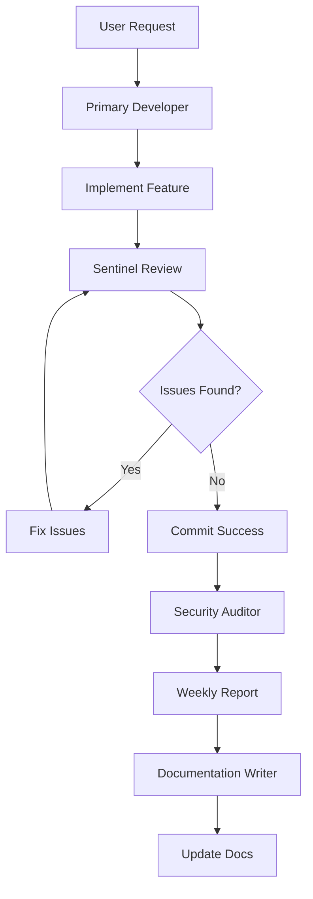

# LCT Commit AI Agents Registry

**Project:** Healthcare Claims Adjudication System  
**Partnership:** LCT Group (Kenya) + Vitraya Technologies (India)  
**Critical Goal:** 90%+ accuracy by October 7, 2025

---

## 🤖 Active Agents

| Agent | Role | When It Runs | Integration | Priority |
|-------|------|--------------|-------------|----------|
| **Primary Developer** | Feature implementation, teaching | Interactive (Cursor Chat) | Manual | CRITICAL |
| **Sentinel (Code Reviewer)** | Security, bugs, accessibility | Pre-commit, PRs | Automated | CRITICAL |
| **Security Auditor** | Deep security analysis | Weekly scans | Scheduled | HIGH |
| **Documentation Writer** | API docs, comments | On-demand | Manual | MEDIUM |

## 🧠 Shared Memory System

All agents use a **mem0-based shared memory system** for collaborative intelligence:

- **Persistent Context:** Agents remember decisions, learnings, and context across sessions
- **Shared Knowledge:** All agents access the same memory base for consistency
- **Collaborative Learning:** Agents build on each other's insights and experiences
- **Project Continuity:** No loss of context when switching between agents

### Memory Categories
- **Project Memories:** Business context, technical decisions, success criteria
- **Development Memories:** Code patterns, feature history, bug resolutions
- **Session Memories:** Current work, user preferences, active issues
- **Shared Memories:** Cross-agent learnings and system insights

---

## 🔄 Agent Interaction Workflow



## 📋 Agent Responsibilities

### Primary Developer (Interactive)
- **When:** User requests in Cursor Chat
- **Focus:** Feature implementation, teaching, debugging
- **Expertise:** Healthcare claims, fraud detection, beginner-friendly code
- **Output:** Working code, explanations, tests

### Sentinel (Automated)
- **When:** Every commit, PR review, push to main
- **Focus:** Security vulnerabilities, accessibility, code quality
- **Expertise:** OWASP Top 10, WCAG 2.2, LCT-specific validations
- **Output:** GitHub comments, Linear issues, commit blocks

### Security Auditor (Scheduled)
- **When:** Weekly automated scans
- **Focus:** Deep security analysis, compliance checks
- **Expertise:** HIPAA/GDPR, financial data protection, audit trails
- **Output:** Security reports, compliance status

### Documentation Writer (On-demand)
- **When:** After feature completion, API changes
- **Focus:** Code comments, API docs, user guides
- **Expertise:** Technical writing, code documentation
- **Output:** Updated documentation, inline comments

---

## 🎯 LCT-Specific Agent Context

### 31 Success Criteria Alignment
All agents understand and work toward the 31 evaluation criteria:

- **4 CRITICAL criteria** (must work perfectly)
- **17 HIGH priority** criteria (very important)
- **10 MEDIUM/LOW** criteria (nice to have)

### Priority Framework
```
CRITICAL → High → Medium → Low
```

### Key Business Logic
- Invoice amount precedence: LCT → ETIMS → Document
- Fraud detection patterns (18 criteria)
- Financial validation (server-side only)
- PHI/PII protection (encrypted at rest and in transit)

---

## 🛠️ Adding New Agents

### 1. Create Agent Definition
```bash
# Create new agent file
touch docs/agents/[agent-name].md
```

### 2. Define Agent Role
```markdown
# [Agent Name] - [Brief Description]

## Role
[What this agent does]

## Expertise
[Technical areas of focus]

## When It Runs
[Trigger conditions]

## Integration Points
[How it connects to other agents]

## LCT-Specific Context
[Healthcare claims knowledge]
```

### 3. Update Registry
Add the new agent to this README.md table.

### 4. Configure Integration
- Add to `.cursor/rules/claude.md` if Cursor-specific
- Add to `.claude/agents/` if Claude-specific
- Add to GitHub Actions if automated
- Add to Linear if issue-tracking

---

## 🔧 Agent Configuration

### Cursor Integration
Agents are configured in `.cursor/rules/claude.md` which references this directory.

### Claude Integration
Claude-specific configs are in `.claude/agents/` which point to universal docs.

### GitHub Actions
Automated agents run via workflows in `.github/workflows/`.

### Linear Integration
Issue creation is handled by Sentinel and Security Auditor.

---

## 📊 Success Metrics

### Agent Effectiveness
- **Primary Developer:** Feature completion rate, user satisfaction
- **Sentinel:** Security issues caught, false positive rate
- **Security Auditor:** Compliance score, vulnerability detection
- **Documentation Writer:** Documentation coverage, clarity score

### LCT Project Goals
- **90% accuracy target** (October 7, 2025)
- **31 criteria completion** (tracked in HTML dashboard)
- **Security compliance** (no CRITICAL issues in production)
- **Team productivity** (faster development, fewer bugs)

---

## 🚨 Emergency Procedures

### If Primary Developer is Unresponsive
1. Check Cursor Chat connectivity
2. Restart Cursor IDE
3. Verify `.cursor/rules/claude.md` is loaded
4. Escalate to human team lead

### If Sentinel Blocks All Commits
1. Review CRITICAL issues in GitHub
2. Fix security vulnerabilities
3. Use `git commit --no-verify` only in emergencies
4. Create Linear issue for tracking

### If Security Auditor Finds Critical Issues
1. Immediately review security report
2. Create Linear issues for all CRITICAL findings
3. Block deployments until resolved
4. Notify team leads

---

## 📚 Resources

### Agent Documentation
- [Primary Developer](primary-developer.md)
- [Sentinel Code Reviewer](code-reviewer-sentinel.md)
- [Agent Integrations](integrations.md)
- [Memory System](memory-system.md)

### Project Context
- [LCT Project Overview](../claude.md)
- [31 Success Criteria](../lct-tracker-html.html)
- [Security Best Practices](../SECURITY_BEST_PRACTICES.md)

### External Resources
- [OWASP Top 10 2025](https://owasp.org/www-project-top-ten/)
- [WCAG 2.2 Guidelines](https://www.w3.org/WAI/WCAG22/quickref/)
- [Linear API Documentation](https://developers.linear.app/)

---

**Last Updated:** [Current Date]  
**Version:** 1.0.0  
**Maintainer:** LCT-Vitraya Development Team
