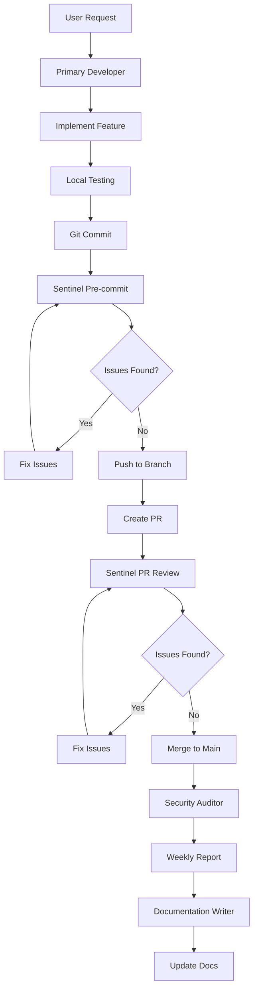

# Agent Integrations Guide

**Project:** LCT Commit Healthcare Claims Adjudication System  
**Purpose:** How AI agents work together in the development workflow

---

## 🔄 Agent Interaction Workflow

### Development Cycle


### Agent Handoff Points
1. **Primary Developer → Sentinel:** Code commit/PR
2. **Sentinel → Linear:** Issue creation for findings
3. **Security Auditor → Linear:** Weekly security reports
4. **Documentation Writer → Team:** Updated documentation

---

## 🛠️ Integration Points

### 1. Cursor IDE Integration

**Primary Developer Agent**
- **Location:** `.cursor/rules/claude.md`
- **Trigger:** User opens Cursor Chat
- **Context:** Full project context, user preferences, LCT criteria
- **Output:** Code implementation, explanations, guidance

**Configuration:**
```markdown
# In .cursor/rules/claude.md
## Agent System

This project uses a hybrid agent architecture. For detailed agent
definitions, see:

- Primary Developer: docs/agents/primary-developer.md
- Code Reviewer (Sentinel): docs/agents/code-reviewer-sentinel.md
- Agent Registry: docs/agents/README.md

[Rest of existing content...]
```

### 2. GitHub Actions Integration

**Sentinel Code Review**
- **Location:** `.github/workflows/sentinel-pr-review.yml`
- **Trigger:** Pull request opened/updated
- **Context:** Changed files, commit messages, PR description
- **Output:** GitHub comments, Linear issues, PR status

**Configuration:**
```yaml
name: Sentinel PR Review
on:
  pull_request:
    types: [opened, synchronize, reopened]

jobs:
  sentinel-review:
    runs-on: ubuntu-latest
    steps:
      - uses: actions/checkout@v3
      - name: Run Sentinel Review
        run: |
          # Reference docs/agents/code-reviewer-sentinel.md
          # for review criteria and LCT-specific rules
          ./scripts/sentinel-review.sh
      - name: Create Linear Issues
        if: failure()
        run: |
          # Create Linear issues for CRITICAL/HIGH findings
          ./scripts/create-linear-issues.sh
```

**Pre-commit Hook**
- **Location:** `.git/hooks/pre-commit`
- **Trigger:** `git commit`
- **Context:** Staged files, commit message
- **Output:** Block commit if CRITICAL issues found

### 3. Linear Integration

**Issue Creation Workflow**
- **Trigger:** Sentinel finds CRITICAL/HIGH issues
- **Context:** Issue details, file locations, severity
- **Output:** Linear issues with proper labels and assignments

**Configuration:**
```javascript
// Linear issue creation
const linearIssue = {
  title: `[Sentinel] ${issueType} in ${fileName}:${lineNumber}`,
  description: `
🛡️ **Sentinel Code Review Alert**

**Severity:** ${severity}
**Category:** ${category}
**File:** \`${filePath}:${lineNumber}\`
**Commit:** ${commitSha}
**PR:** #${prNumber}

## Issue Details
${detailedDescription}

## Code Location
\`\`\`${language}
${codeSnippet}
\`\`\`

## Impact
${impactDescription}

## Recommended Fix
\`\`\`${language}
${fixedCodeExample}
\`\`\`

---
**Related to LCT Success Criteria:** ${criteriaNumber}
**Auto-generated by:** Sentinel v1.0.0
**Detection Time:** ${timestamp}
  `,
  priority: severity === 'CRITICAL' ? 1 : severity === 'HIGH' ? 2 : 3,
  labels: [`sentinel-${severity.toLowerCase()}`, category.toLowerCase()],
  assignee: severity === 'CRITICAL' ? 'security-team' : 'tech-lead'
};
```

### 4. Security Auditor Integration

**Weekly Security Scans**
- **Trigger:** Scheduled (every Monday)
- **Context:** Full codebase, dependency audit, compliance check
- **Output:** Security report, compliance status, Linear issues

**Configuration:**
```yaml
name: Weekly Security Audit
on:
  schedule:
    - cron: '0 9 * * 1'  # Every Monday at 9 AM
  workflow_dispatch:  # Manual trigger

jobs:
  security-audit:
    runs-on: ubuntu-latest
    steps:
      - uses: actions/checkout@v3
      - name: Run Security Audit
        run: |
          # Reference docs/agents/security-auditor.md
          # for audit criteria and LCT-specific checks
          ./scripts/security-audit.sh
      - name: Generate Security Report
        run: |
          ./scripts/generate-security-report.sh
      - name: Create Linear Issues
        run: |
          # Create issues for security findings
          ./scripts/create-security-issues.sh
```

### 5. Documentation Writer Integration

**On-demand Documentation**
- **Trigger:** Manual request or after feature completion
- **Context:** Code changes, API updates, feature descriptions
- **Output:** Updated documentation, inline comments

**Configuration:**
```javascript
// Documentation update trigger
const docUpdate = {
  trigger: 'feature-complete',
  context: {
    feature: 'Invoice validation',
    files: ['src/validation.js', 'src/api.js'],
    criteria: '#4 Invoice amount precedence'
  },
  output: {
    apiDocs: 'docs/api/invoice-validation.md',
    inlineComments: 'src/validation.js',
    userGuide: 'docs/user-guide/validation.md'
  }
};
```

---

## 🔧 Setup and Configuration

### 1. Initial Setup

**Run the setup script:**
```bash
./scripts/agent-setup.sh
```

This script will:
- Validate all agent files exist
- Set up pre-commit hooks
- Configure GitHub Actions
- Test Linear integration
- Create team onboarding checklist

### 2. Team Onboarding

**For new team members:**
1. Clone the repository
2. Run `./scripts/agent-setup.sh`
3. Read `docs/agents/README.md`
4. Set up personal Cursor memories (optional)
5. Test with a simple commit

### 3. Agent Configuration

**Cursor Configuration:**
```markdown
# .cursor/rules/claude.md
## Agent System

This project uses a hybrid agent architecture. For detailed agent
definitions, see:

- Primary Developer: docs/agents/primary-developer.md
- Code Reviewer (Sentinel): docs/agents/code-reviewer-sentinel.md
- Agent Registry: docs/agents/README.md

[Keep existing content but reference universal docs]
```

**Claude Configuration:**
```markdown
# .claude/agents/code-reviewer.md
# Sentinel Code Review Agent

> **Note:** This file is a Claude-specific configuration.
> For universal documentation, see: `docs/agents/code-reviewer-sentinel.md`

[Include essential config, reference main docs for details]
```

---

## 📊 Monitoring and Metrics

### Agent Performance Metrics

**Primary Developer:**
- Feature completion rate
- User satisfaction score
- Code quality metrics
- Teaching effectiveness

**Sentinel:**
- Security issues caught
- False positive rate
- Review time per PR
- Issue resolution time

**Security Auditor:**
- Compliance score
- Vulnerability detection rate
- Audit coverage
- Issue severity distribution

**Documentation Writer:**
- Documentation coverage
- Clarity score
- Update frequency
- User feedback

### LCT Project Metrics

**Success Criteria Tracking:**
- 31 criteria completion percentage
- CRITICAL criteria status (4 items)
- HIGH priority progress (17 items)
- Overall accuracy toward 90% goal

**Quality Metrics:**
- Security compliance score
- Accessibility compliance
- Performance benchmarks
- User experience metrics

---

## 🚨 Troubleshooting

### Common Issues

**1. Sentinel Not Running**
```bash
# Check pre-commit hook
ls -la .git/hooks/pre-commit

# Reinstall if missing
./scripts/agent-setup.sh
```

**2. Linear Issues Not Creating**
```bash
# Check environment variables
echo $LINEAR_API_KEY
echo $LINEAR_TEAM_ID

# Test Linear connection
./scripts/test-linear-connection.sh
```

**3. GitHub Actions Failing**
```bash
# Check workflow files
ls -la .github/workflows/

# Test locally
act -j sentinel-review
```

**4. Cursor Not Loading Agent Context**
```bash
# Check .cursor/rules/claude.md exists
ls -la .cursor/rules/

# Restart Cursor IDE
# Check for syntax errors in claude.md
```

### Emergency Procedures

**If Sentinel Blocks All Commits:**
1. Review CRITICAL issues in GitHub
2. Fix security vulnerabilities
3. Use `git commit --no-verify` only in emergencies
4. Create Linear issue for tracking

**If Linear Integration Fails:**
1. Check API key validity
2. Verify team ID is correct
3. Test with manual issue creation
4. Escalate to team lead

**If GitHub Actions Fail:**
1. Check workflow syntax
2. Verify environment variables
3. Test scripts locally
4. Review GitHub Actions logs

---

## 🔄 Adding New Integrations

### 1. New Agent Integration

**Step 1: Create Agent Definition**
```bash
# Create new agent file
touch docs/agents/[agent-name].md
```

**Step 2: Define Integration Points**
```markdown
# In docs/agents/[agent-name].md
## Integration Points
- **Trigger:** [When this agent runs]
- **Context:** [What information it needs]
- **Output:** [What it produces]
- **Dependencies:** [Other agents it works with]
```

**Step 3: Update Registry**
```markdown
# In docs/agents/README.md
| [Agent Name] | [Role] | [When It Runs] | [Integration] | [Priority] |
```

**Step 4: Configure Integration**
- Add to `.cursor/rules/claude.md` if Cursor-specific
- Add to `.claude/agents/` if Claude-specific
- Add to GitHub Actions if automated
- Add to Linear if issue-tracking

### 2. New Tool Integration

**Step 1: Identify Integration Point**
- Where does the tool fit in the workflow?
- What triggers it?
- What information does it need?
- What does it produce?

**Step 2: Create Integration Script**
```bash
# Create integration script
touch scripts/integrate-[tool-name].sh
```

**Step 3: Update Workflows**
- Add to GitHub Actions if automated
- Add to pre-commit hooks if local
- Add to documentation if manual

**Step 4: Test Integration**
```bash
# Test the integration
./scripts/integrate-[tool-name].sh --test
```

---

## 📚 Resources

### Agent Documentation
- [Agent Registry](README.md)
- [Primary Developer](primary-developer.md)
- [Sentinel Code Reviewer](code-reviewer-sentinel.md)

### Integration Guides
- [GitHub Actions Documentation](https://docs.github.com/en/actions)
- [Linear API Documentation](https://developers.linear.app/)
- [Cursor IDE Documentation](https://cursor.sh/docs)

### LCT Project Context
- [Project Overview](../claude.md)
- [31 Success Criteria](../lct-tracker-html.html)
- [Security Best Practices](../SECURITY_BEST_PRACTICES.md)

---

**Last Updated:** [Current Date]  
**Version:** 1.0.0  
**Maintainer:** LCT-Vitraya Development Team
